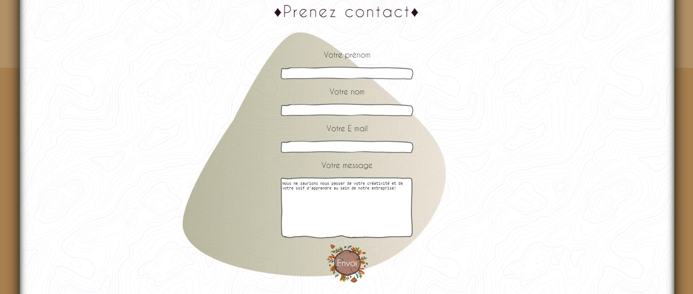

# CV Mylène Vandaële

## Contexte

Réalisé dans le cadre du programme IDP soutenu par l'Afpa et Aston. Le CV sera alimenté et complété au fur et à mesure de l'apprentissage de nombreux langages de programmation jusqu'a devenir un portfolio.

## Tech actuellement utilisées

* HTML
* SASS
* PHP - PDO

## Librairies actuellement utilisées

* https://icones8.fr/icon/pack/logos/doodle

## Aperçu du résultat

## A venir ...

* Un menu afin d'accèder plus rapidement aux différentes sections qui s'aggrandissent (style non défini).
* Une section "Hobbies".
* Une section "Creation".
* Ajout de Javascript pour dynamiser notre page.
